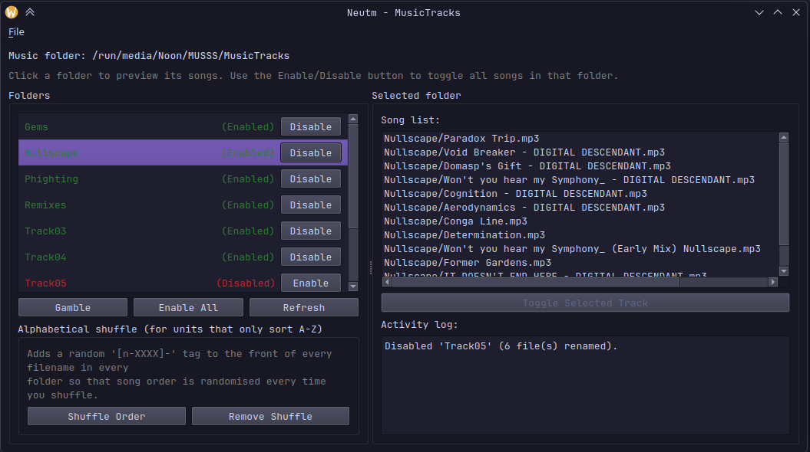
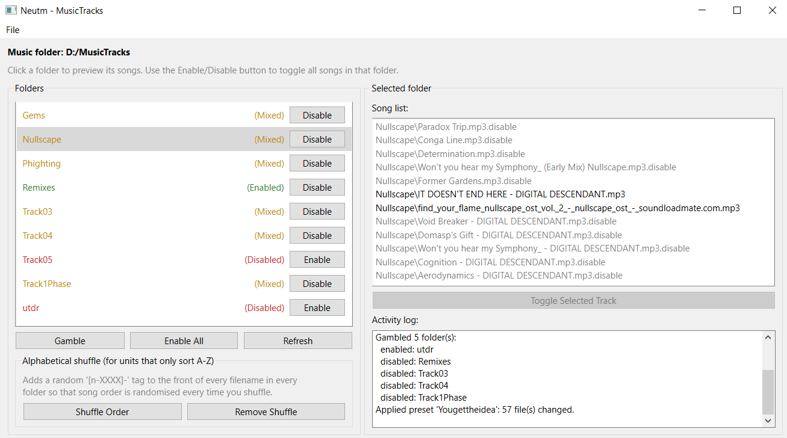

# Neutm

A lightweight CLI/GUI tool for managing USB music libraries and improving limited car stereo and MP3 player support

Many physical music players, such as car stereo systems or older USB audio devices, have limited library management features. Some units may only sort music alphabetically without the ability to shuffle or lack playlist support.

Neutm helps work around these limitations by allowing you to organise your music library by using folders, you can enable or disable sections of your collection or create different music setups without deleting or having to move files.

## How it works
Neutm doesn't move or delete your files, primarily working with filename tricks that USB players will respect.
- **Enable/Disable**: disabling a track appends `.disable` to its filename (e.g. `song.mp3` -> `song.mp3.disable`). Most players only use known audio extensions, so a `.disable` file will be ignored without deleting the file
- **Shuffle**: prepends a random 4-character tag to the filename (e.g. `song.mp3` → `[n-aX3f]-song.mp3`). For alphabetical only players which sort only by filename, this command will randomize the playback order.
- **Presets**: a preset is just a saved snapshot of which tracks were enabled/disabled at a point in time (stored as JSON.)

## Screenshots


<br clear="both">

*Neutm GUI*

## Features
- Enable or disable entire folders of music
- Split a large music library into sections
- Toggle individual tracks on or off
- Create and load playlist presets
- Randomly enable and disable folders (Gamble mode)
- Shuffle the start of the filename for devices that only sort alphabetically
- Supports both GUI and CLI interfaces
- Designed for physical media such as USB drives and standalone music players

## CLI Commands
| Option | Description |
|---|---|
| `--status` | Show enabled/disabled/mixed status of each folder in the directory |
| `--enable-folder FOLDER` | Enable all tracks in a folder |
| `--disable-folder FOLDER` | Disable all tracks in a folder |
| `--toggle-track TRACK` | Enable/disable a single track |
| `--enable-all` | Enable every track in the library |
| `--disable-all` | Disable every track in the library |
| `--shuffle` | Shuffles the start of the filename so alphabetical players play in random order |
| `--unshuffle` | Remove shuffle |
| `--gamble` | Randomly enable/disable folders |
| `--save-preset NAME` | Save the current enable/disable state as a preset |
| `--load-preset NAME` | Apply a saved preset |
| `--list-presets` | List saved presets |

### Examples:
Enable a folder:
```bash
neutm /media/USB --enable-folder Track01
```

Disable everything:
```bash
neutm /media/USB --disable-all
```

Load a playlist setup:
```bash
neutm /media/USB --load-preset Playlist4
```

## Installation

### Windows

Download the latest Windows release from the Releases page.
Extract `Neutm-Windows.zip` and run:
```text
Neutm.exe
```


### Install from source

#### Requirements

- Python 3.10 or newer
- pip


Clone the Neutm repository:
```bash
git clone https://github.com/Nooned0/Neutm.git
cd Neutm
```

Install Neutm and its dependencies:
```bash
pip install .
```

Neutm is now installed and can be launched with
```bash
neutm
```

